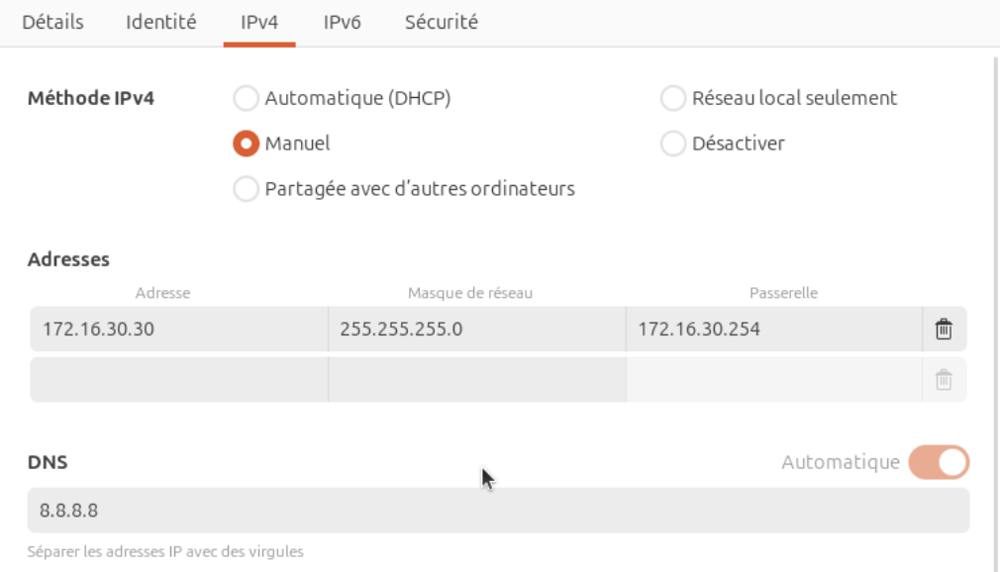
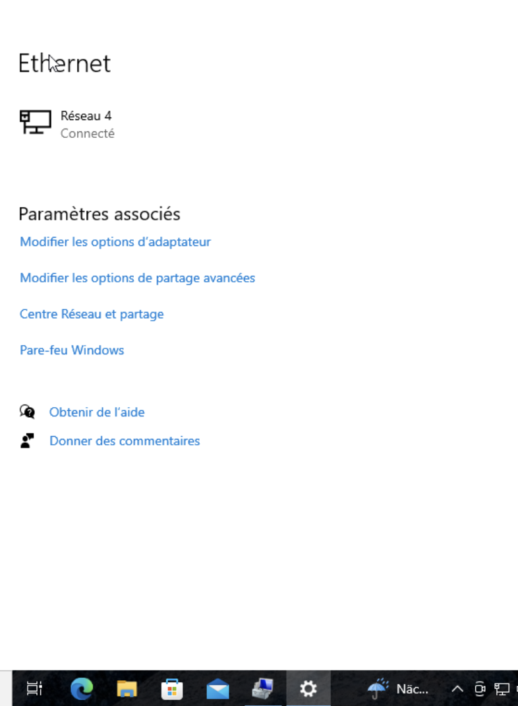
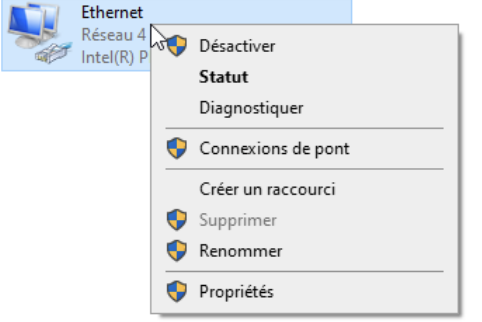
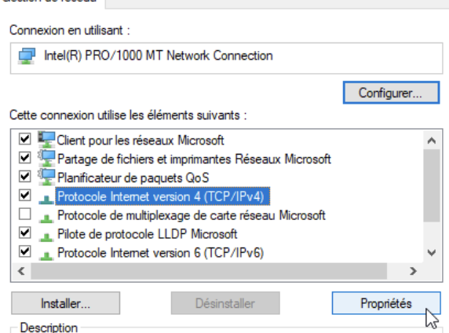
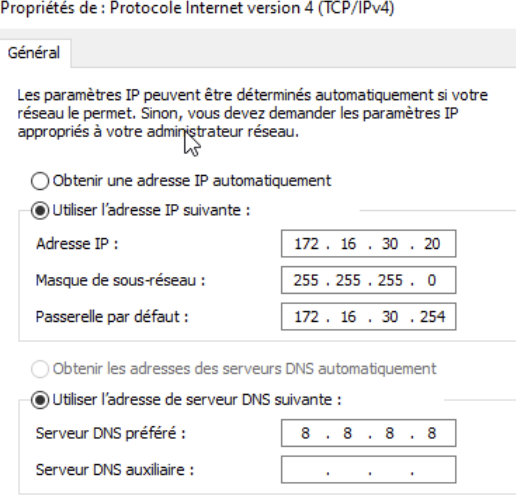
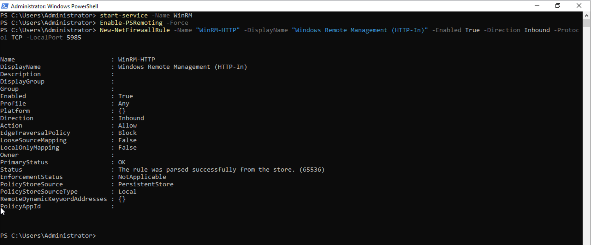
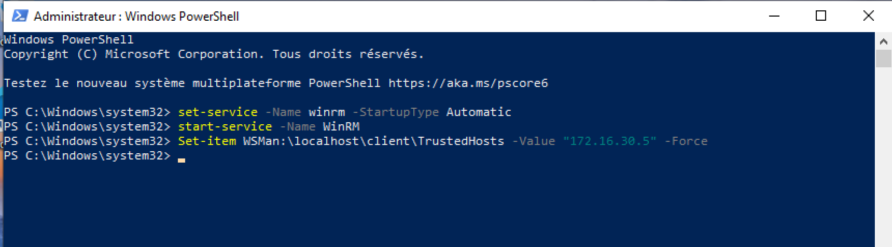
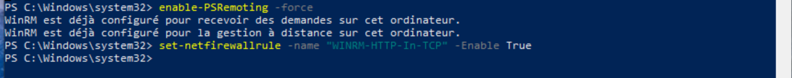
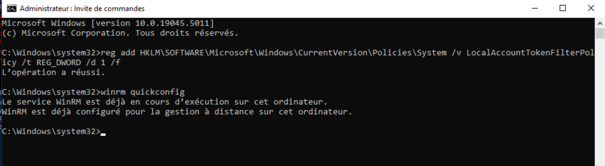

# Guide d'installation

Vous trouverez dans ce document la manière de configurer vos machines afin d'utiliser ```script.sh```et ```script.ps1```, dont le but est la gestion et le relevé d'informations à distance d'ordinateurs clients ou d'utilisateurs locaux.  

---
## Un serveur Linux et son client Linux

### Les prérequis techniques
- Avoir une machine Serveur Débian 12 et au moins une machine client Ubuntu 24.04LTS
- Avoir des droits administrateurs sur toutes les machines.
- Avoir des connaissances basique en Bash.
- Avoir une connexion internet.


### 1) Définir une adresse IP fixe
#### Sur le serveur
Il faudra se rendre dans le ficher interfaces et le modifier avec une adresse IP, un DNS, une passerelle et un masque de sous-réseau.
```sudo nano /etc/network/interfaces```

 

```
#The primary network interface
auto enp0s18
iface enp0s18 inet static
address 172.16.30.10
netmask 255.255.255.0
dns-nameservers 8.8.8.8
gateway 172.16.30.254
```
Sauvegardez ensuite le fichier.  

Redémmarez le réseau grâce à ```systemctl restart networking``` et vérifiez la nouvelle adresse IP avec  ```ip a```  
Les changements devraient avoir eu lieu.  

Faites un ping vers Google pour vérifier la connexion au réseau internet :```ping 8.8.8.8```  
#### Sur le client
Pour définir une adresse IP fixe, il faudra vous rendre dans les paramètres filaires de votre machine cliente.  
 
 

Selectionnez ipv4 et faites les modifications suivantes manuellement
```
addresse 172.16.30.30
masque de réseau 255.255.255.0
DNS 8.8.8.8
passerelle 172.16.30.254
```


### 2) Renommer les machines

Pour changer le nom de la machine : ```sudo nano /etc/hostname```
Donnez lui un nouveau nom :  ici SRVLX01 pour le serveur et CLILIN01 pour la machine cliente.
Sauvegardez puis fermez le fichier.
Pour indiquer aux autres machines le nom des différentes machines sur le réseau : ```sudo nano /etc/hosts```  
Nous allons modifier les nom afin qu’ils soient bien pris en compte.  
 

```
172.16.30.10	SRVLX01
172.16.30.30	 CLILIN01
```
  
Une fois terminé, sauvegardez puis fermez.  
Faites un redémarrage de la machine pour prendre en compte le nouveau nom : ```reboot```  
Une fois redémarré, le nouveau nom de la machine apparaît.  

### 3) Installation SSH
#### Étape 0
Vous pouvez créér un utilisateur local sur chacune de vos machines clientes, sur lequel SSH sera installé (par exemple utilisateur_ssh pour le besoin du script).  
ajoutez-le au groupe sudo avec ```sudo usermod -aG sudo utilisateur_ssh```et vérifiez avec ```groups utilisateur_ssh```  
  
#### Étape 1 
Il est fortement conseillé que vous mettiez à jour vos machines pour permettre une installation fluide de SSH et vérifier que tous les paquets soit à jour. Vous devrez utiliser les commandes ```sudo apt update && sudo apt upgrade -y```  
 
#### Étape 2
Une fois la première étape terminée,vous pourrez installer le SSH sur le serveur et les clients.  
```sudo apt install ssh```  
#### Étape 3
Lorsque l'installation est terminé,SSH devrait démarrer automatiquement,vous allez vérifier cela avec ```sudo systemctl status```et voici ce qui devrait s'afficher :  
 
Dans certains cas, il se peut que SSH ne soit pas démarré,vous devrez donc faire ```sudo systemctl start ssh``` ou ```sudo systemctl enable ssh```dans d'autres cas.  
SSh devrait être installé correctement désormais.

#### Étape 4
**Sur le serveur** :
Se connecter sur le compte "root" et créer la clé publique grâce à la commande ```ssh-keygen -t rsa -b 4096```.  
  
Envoyer la clé aux comptes utilisateur_ssh sur chaque client grâce à la commande ```ssh-copy-id USERNAME@ADDRESSIP```.  
  
Tester la connexion SSH grâce à ```ssh USERNAME@ADDRESSIP```.  

### 4) La récupération du Script
Lorsque l'installation SSH sera terminée,vous devrez récupérer votre script. Vous pouvez passer depuis votre ordinateur client pour télécharger votre script depuis github et le transférer en toute sécurité sur votre serveur. On supposera que vous voudrez copier votre script vers le dossier lib de la débian et que votre script se trouve dans /home/wilder.  
```scp -r /home/wilder/script.sh root@172.16.30.10:/var/lib```  
Votre script devrait être sur votre machine serveur.  
Si vous avez dez difficultés à copier votre script,rendez-vous dans le fichier ```/etc/ssh/sshd_config``` et ouvrez le.  
cherchez la ligne ```PermitRootLogin```,enlevez le # et faites ```yes```
  

## Un serveur Windows et son client Windows

### Les prérequis techniques
- Avoir une machine Serveur Windows Server 2022 et au moins une machine client Windows 10.
- AVoir des droits administrateurs sur toutes les machines.
- Avoir des connaissances basique en Powershell.
- Avoir une connexion internet.

### 1)Configurer les adresses IP
La configuation de l'IP est la même pour les 2 windows,seule l'adresse IP changera.  
Rendez-vous dans l'onglet réseau en bas à droite de l'écran et cliquez sur ```modifier les options d'adaptateur```



Faites un clic droit sur ```ethernet``` et sélectionnez ```propriétés```.



Cliquez sur protocole internet version 4 et sélectionnez une nouvelle fois propriété.



Ensuite faites les modifications nécessaires pour votre adresse IP



Pour votre Windows Server 2022 :

```
addresse IP 172.16.30.5
masque de sous-réseau 255.255.255.0
serveur DNS préféré 8.8.8.8
passerelle par défaut 172.16.30.254
```

Pour la Windows 10 :

```
addresse IP 172.16.30.20
masque de sous-réseau 255.255.255.0
serveur DNS préféré 8.8.8.8
passerelle par défaut 172.16.30.254
```

Redémarrez votre ordinateur et faites ensuite ```ipconfig /all``` pour vérifier l'adresse ip.

## Configuration de WinRM
### Sur le serveur
Dans une console Powershell en tant qu'administrateur, entrez les commandes ```Start-Service -Name WinRM```et ```Enable-PSRemoting -Force```  

Si votre pare-feu est activé, tapez ```New-NetFirewallRule -Name "WinRM-HTTP" -DisplayName "Windows Remote Management (HTTP-In)" -Enabled True -Direction Inbound -Protocol TCP -LocalPort 5985```  



Entrez tous les machines de votre réseau en hôte de confiance : ```Set-Item WSMan:\localhost\Client\TrustedHosts -Value "172.16.30.*" -Force```
### Sur le client
Dans une console Powershell en tant qu'administrateur,entrez les commandes ```Set-Service -Name winrm -StartupType Automatic```et ```Start-Service -Name WinRM```.   

Autorisez le serveur à se conecter : ```Set-Item WSMan:\localhost\Client\TrustedHosts -Value "N172.16.30.5" -Force```.  

Si votre pare-feu est activé, tapez ```Set-NetConnectionProfile -InterfaceIndex (Get-NetConnectionProfile).InterfaceIndex -NetworkCategory Private```, ```Enable-PSRemoting -Force``` puis ```Set-NetFirewallRule -Name "WINRM-HTTP-In-TCP" -Enabled True```.  

Puis dans une console cmd.exe en administrateur, entrez ```reg add HKLM\SOFTWARE\Microsoft\Windows\CurrentVersion\Policies\System /v LocalAccountTokenFilterPolicy /t REG_DWORD /d 1 /f``` et ``ẁinrm quickconfig```  


## Installation de Chocolatey sur le client
Dans un Powershell, tapez ```Set-ExecutionPolicy AllSigned -Scope Process -Force; iwr https://community.chocolatey.org/install.ps1 -UseBasicParsing | iex```.  


## Installation de Powershell 7.4 sur le serveur
Pour installer ce logiciel, téléchargez-le en suivant ce lien : [PowerShell-7.4.1-win-x64.msi](https://github.com/PowerShell/PowerShell/releases/download/v7.4.1/PowerShell-7.4.1-win-x64.msi).  
Lancez le fichier et suivez les directives d'installation.  

## La Foire aux Questions
"Je n'arrive pas à installer Chocolatey ou Powershell 7.4" :  
Vérifiez bien que vous êtes en tant qu'administrateur et que votre connexion Internet soit bonne.  

"Je n'arrive pas à lancer mon script" :  
Sur windows, lancez la commande ```Set-ExecutionPolicy -Scope CurrentUser -ExecutionPolicy Unrestricted```. Sur Linux, tapez la commande ```chmod u+x ./script.sh```.   
