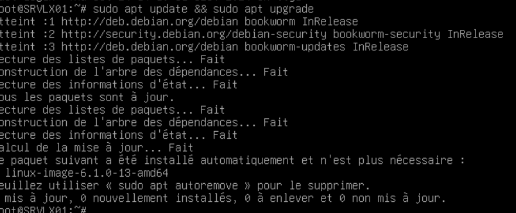
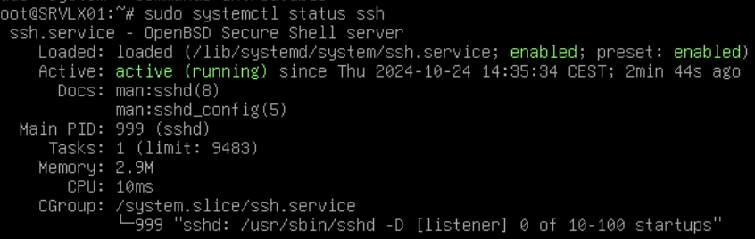
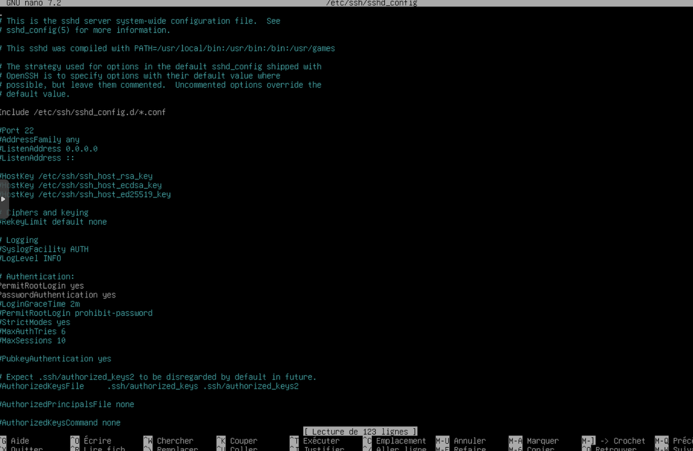
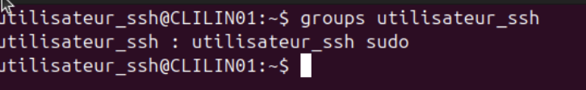

# Guide d'installation

Vous trouverez dans ce document la manière de configurer vos machines afin d'utiliser ```script.sh```et ```script.ps1```, dont le but est la gestion et le relevé d'informations à distance d'ordinateurs clients ou d'utilisateurs locaux.  

---
## Un serveur Linux et son client Linux

### Les prérequis techniques
Serveur + client
connaissance de la configuration du réseau
connaissance de Linux et console
droit admin sur serveur et client

#### La configuration de la connexion SSH entre le serveur et les clients
config IP serveur  
config IP client  
check des ping  
ajout du sudo au compte utilisateur du serveur  
création du compte utilisateur_ssh sur les clients  
## Étapes d'installation sur Débian 12
##### Étape 1 
Il est fortement conseillé que vous mettiez à jour votre débian pour permettre une installation fluide de SSH et vérifier que tous les paquets soit à jours.Vous devrez utiliser les commandes ```sudo apt update && sudo apt upgrade```
 
##### Étape 2
Une fois la première étape terminée,vous pourrez installer le SSH sur le serveur et les clients.
```sudo apt install ssh```
##### Étape 3
Lorsque l'installation est terminé,SSH devrait démarrer automatiquement,vous allez vérifier cela avec ```sudo systemctl status```et voici ce qui devrait s'afficher

 

Dans certains cas il se peut que SSH ne soit pas démmaré,vous devrez donc faire ```sudo systemctl start ssh``` ou ```sudo systemctl enable ssh```dans d'autres cas.SSh devrait être installé correctement désormais.
##### Étape 4
Se connecter sur le compte "root" et créer la clé publique grâce à la commande ```ssh-keygen -t rsa -b 4096```.  
  
Envoyer la clé aux comptes utilisateur_ssh sur chaque client grâce à la commande ```ssh-copy-id USERNAME@ADDRESSIP```.  
  
Tester la connexion SSH grâce à ```ssh USERNAME@ADDRESSIP```.  

#### La récupération du Script
Lorsque l'installation SSH sera terminée,vous devrez récupérer votre script.Vous pouvez passer depuis votre ordinateur client pour télécharger votre script depuis github et le transférer en toute sécurité sur votre serveur.On supposera que vous voudrez copier votre script vers le dossier lib de la débian et que votre script se trouve dans /home/wilder.
```scp -r /home/wilder/script.sh root@172.16.30.10:/var/lib```
Votre script devrait être sur votre machine serveur.
Si vous avez dez difficultés à copier cotre script,rendez-vous dans le fichier ```/etc/ssh/sshd_config``` et ouvrez le
cherchez la ligne ```PermitRootLogin```,enlevez le # et faites ```yes```


  


## Étapes d'installations sur Ubuntu 
#### Étape 1
Vous pouvez créér un utilisateur local sur lequel SSH sera installé (par exemple utilisateur_ssh pour le besoin du script) et ajoutez le au groupe sudo avec ```sudo usermod -aG sudo utilisateur_ssh```et vérifiez avec ```groups utilisateur_ssh```
  


### La Foire aux Questions


---
## Un serveur Windows et son client Windows

### Les prérequis techniques

### Les étapes d'installation et de configuration

### La Foire aux Questions
