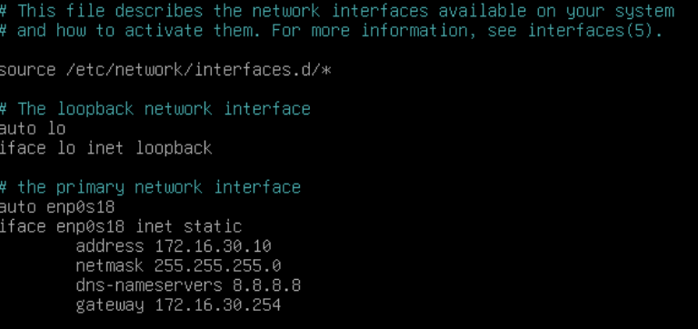
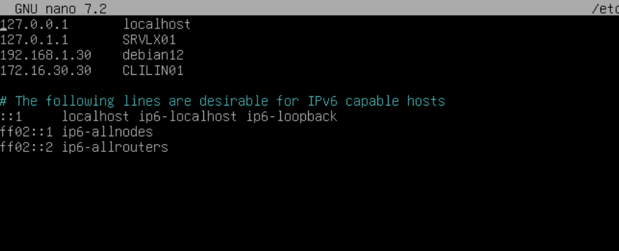
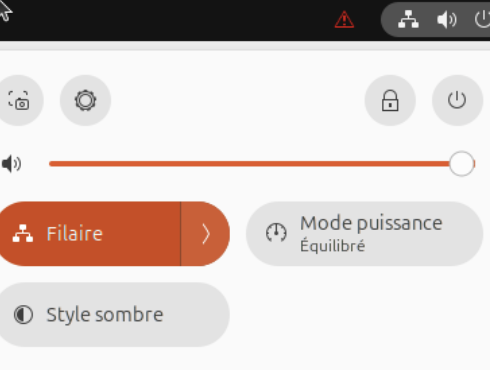

# Guide d'installation

Vous trouverez dans ce document la manière de configurer vos machines afin d'utiliser ```script.sh```et ```script.ps1```, dont le but est la gestion et le relevé d'informations à distance d'ordinateurs clients ou d'utilisateurs locaux.  

---
## Un serveur Linux et son client Linux

### Les prérequis techniques
Serveur + client
connaissance de la configuration du réseau
connaissance de Linux et console
droit admin sur serveur et client


## Étapes d'installation sur Débian 12

### 1) Définir une adresse ip fixe
Il faudra se rendre dans le ficher interfaces et le modifier avec une adresse ip,un DNS,un pont et un masque de sous-réseau.
```sudo nano /etc/network/interfaces```

 

```#The primary network interface```

```auto enp0s18```

```Iface enp0s18 inet static```
	
 ```address 172.16.30.10```
	
 ```netmask 255.255.255.0```

 ```dns-nameservers 8.8.8.8```

```gateway 172.16.30.254```

Sauvegardez ensuite le fichier.

Rédemmarez le réseau grâce à ```systemctl restart networking``` et vérifiez la nouvelle adresse ip avec  ```ip a```
Les changements devraient avoir eu lieux.

Faites un ping vers google pour vérifier la connexion au réseau,```ping 8.8.8.8```

### 2) Renommer le serveur

Pour changer le nom de la machine.

```Sudo nano /etc/hostname```
  
Donnez lui un nouveau nom (ici SRVLX01)
Sauvegardez puis fermez le fichier.

Pour indiquer aux autres machines le nom du serveur sur le réseau.

```Sudo nano /etc/hosts```
  
Nous allons modifier le nom afin qu’il soit bien pris en compte


 

```127.0.1.1	SRVLX01```

Rajoutez en dessous les autres machines si vous souhaitez communiquer avec elles (exemple ci-dessus).

```172.16.0.30	 CLILIN01```
  
Une fois terminé, sauvegarder puis fermer

Faites un redémarrage de la machine pour prendre en compte le nouveau nom.

```reboot```
  
Une fois redémarrée, le nouveau nom de la machine apparaît.

 ### 3) Installation SSH
 
 ##### Étape 1 
Il est fortement conseillé que vous mettiez à jour votre débian pour permettre une installation fluide de SSH et vérifier que tous les paquets soit à jours.Vous devrez utiliser les commandes ```sudo apt update && sudo apt upgrade```
 
##### Étape 2
Une fois la première étape terminée,vous pourrez installer le SSH sur le serveur et les clients.
```sudo apt install ssh```
##### Étape 3
Lorsque l'installation est terminé,SSH devrait démarrer automatiquement,vous allez vérifier cela avec ```sudo systemctl status```et voici ce qui devrait s'afficher

 

Dans certains cas il se peut que SSH ne soit pas démmaré,vous devrez donc faire ```sudo systemctl start ssh``` ou ```sudo systemctl enable ssh```dans d'autres cas.SSh devrait être installé correctement désormais.
##### Étape 4
Se connecter sur le compte "root" et créer la clé publique grâce à la commande ```ssh-keygen -t rsa -b 4096```.  
  
Envoyer la clé aux comptes utilisateur_ssh sur chaque client grâce à la commande ```ssh-copy-id USERNAME@ADDRESSIP```.  
  
Tester la connexion SSH grâce à ```ssh USERNAME@ADDRESSIP```.  

#### La récupération du Script
Lorsque l'installation SSH sera terminée,vous devrez récupérer votre script.Vous pouvez passer depuis votre ordinateur client pour télécharger votre script depuis github et le transférer en toute sécurité sur votre serveur.On supposera que vous voudrez copier votre script vers le dossier lib de la débian et que votre script se trouve dans /home/wilder.
```scp -r /home/wilder/script.sh root@172.16.30.10:/var/lib```
Votre script devrait être sur votre machine serveur.
Si vous avez dez difficultés à copier cotre script,rendez-vous dans le fichier ```/etc/ssh/sshd_config``` et ouvrez le
cherchez la ligne ```PermitRootLogin```,enlevez le # et faites ```yes```


  


## Étapes d'installations sur Ubuntu 

### 1) Définir une adresse ip fixe
Pour définir une adresse ip fixe il faudra vous rendre dans les paramètres filaires de votre machine cliente.
 
 


### 2) Renommer le client

On reprend les mêmes étapes mais le client aura pour nom cette fois-ci Clilin01

### 3) Installation SSH

#### Étape 1
Vous pouvez créér un utilisateur local sur lequel SSH sera installé (par exemple utilisateur_ssh pour le besoin du script) et ajoutez le au groupe sudo avec ```sudo usermod -aG sudo utilisateur_ssh```et vérifiez avec ```groups utilisateur_ssh```
  

#### Étape 2
Pour installer SSH sur la ubuntu vous devrez effectuer exactement les mêmes étapes que pour la débian dans la même ordre.


### La Foire aux Questions


---
## Un serveur Windows et son client Windows

### Les prérequis techniques

### Les étapes d'installation et de configuration

### La Foire aux Questions
