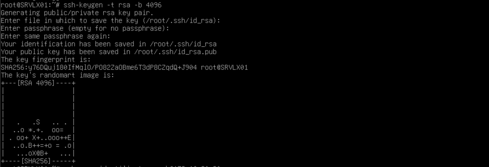
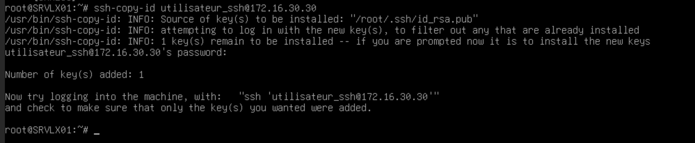

# Guide d'installation

Vous trouverez dans ce document la manière de configurer vos machines afin d'utiliser ```script.sh```et ```script.ps1```, dont le but est la gestion et le relevé d'informations à distance d'ordinateurs clients ou d'utilisateurs locaux.  

---
## Un serveur Linux et son client Linux

### Les prérequis techniques
Serveur + client$
connaissance de la configuration du réseau
connaissance de Linux et console
droit admin sur serveur et client

#### La configuration de la connexion SSH entre le serveur et les clients
config IP serveur  
config IP client  
check des ping  
ajout du sudo au compte utilisateur du serveur  
création du compte utilisateur_ssh sur les clients  
##### Étape 1 
Installer le SSH sur le serveur et les clients  
##### Étape 2
Activer le SSH sur le serveur et les clients  
##### Étape 3
Se connecter sur le compte "root" et créer la clé publique grâce à la commande ```ssh-keygen -t rsa -b 4096```.  
  
Envoyer la clé aux comptes utilisateur_ssh sur chaque client grâce à la commande ```ssh-copy-id USERNAME@ADDRESSIP```.  
  
Tester la connexion SSH grâce à ```ssh USERNAME@ADDRESSIP```.  

#### La récupération du Script


### Les étapes d'installation et de configuration

### La Foire aux Questions


---
## Un serveur Windows et son client Windows

### Les prérequis techniques

### Les étapes d'installation et de configuration

### La Foire aux Questions
