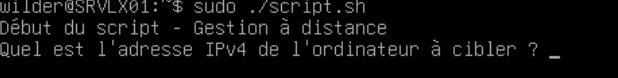
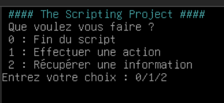
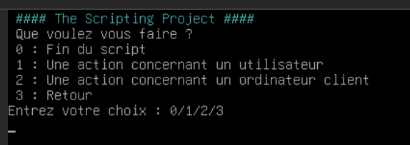
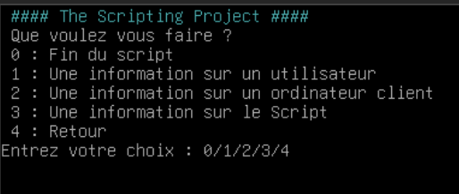
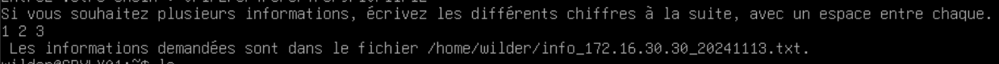
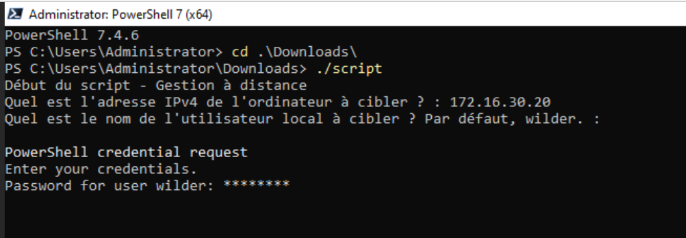

# Guide d'utilisation

Vous trouverez dans ce document la manière d'utiliser ```script.sh```et ```script.ps1```, dont le but est la gestion et le relevé d'informations à distance d'ordinateurs clients ou d'utilisateurs locaux.  

---
## Un serveur Linux et son client Linux

### L'utilisation de base

#### Étape 1
Depuis votre serveur Linux, vous connectez avec un compte utilisateur local, "wilder" pour l'exemple. Le script ```script.sh```se trouve dans le dossier personnel de votre utilisateur.  
#### Étape 2
Entrez l'adresse IP de l'ordinateur client auquel vous voulez accéder. La connexion se fait grâce à une clé publique.


#### Étape 3
Vous pouvez naviguer dans le menu et choisir si vous voulez une action ou une information. Vous aurez ensuite le choix entre cibler un utilisateur local au client précédemment choisi ou cibler l'ordinateur lui-même. 








#### Étape 4
Les informations que vous avez demandé sont stockées dans un fichier dans le dossier personnel de l'utilisateur que vous utilisez.




### L'utilisation avancée
#### Journalisation
Vous pouvez consulter le journal du script à tout moment : il est dans le dossier ```/var/log```et se nomme ```log_evt.log```. Vous y retrouverez les différentes actions, informations et navigations concernant le script, effectué par un utilisateur de votre ordinateur. Chaque ligne de journalisation incluera la date, l'heure, l'utilisateur, l'évévement, la cible et la reussite ou non.  

### La Foire aux Questions
**Je n'arrive pas à lancer le script. Je n'ai pas les droits**  
Il faut impérativement lancer le script en ```sudo```. Si la commande ```sudo``` est introuvable, il faut recommencer l'installation de cette commande, à l'aide du fichier [INSTALL.md](./INSTALL.md).  
**Je n'arrive pas à me connecter à l'ordinateur cible**  
Il faut vérifier l'installation ([INSTALL.md](./INSTALL.md)). Le problème peut être : mauvaise adresse IP, connexion SSH pas installée ou pas active, mauvaise configuration de l'utilisateur SSH, ...    


---
## Un serveur Windows et son client Windows

### L'utilisation de base
Il faut lancer le script.ps1 depuis une console Powershell 7.4 lancée en Administrateur
L'utilisation est identique à celle sur Linux.  
Une différence est à notifier : la connexion entre les deux machines se fait grâce à WinRM.  


### L'utilisation avancée
Vous pouvez retrouver le même fichier de journalisation qu'avec Linux à l'emplacement ```C:\Windows\System32\LogFiles\log_evt.log```.  

### La Foire aux Questions
**Je n'arrive pas à lancer le script. Je n'ai pas les droits**  
Il faut impérativement lancer la console en tant qu'administrateur.  
**Je n'arrive pas à lancer le script car j'ai un message de sécurité.**  
Lancez la commande ```Unblock-file .\script.ps1```.  
